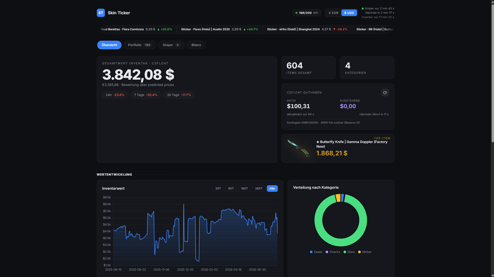

# SkinTicker

**The stock ticker for your CS2 inventory — and the only tracker that balances
your item-for-item trades. Runs wherever you want: PC, server, or NAS. No
account, no cloud, your data stays with you.**



SkinTicker watches CSFloat for cheap buy-now listings, compares them against
the Steam Community Market price, alerts you on good deals via Telegram, and
tracks the value of your inventory over time — including automatic cost basis
from your purchase history and a per-trade balance for item-for-item Steam
trades, which no cloud tracker offers. All in a local web dashboard. Plain
Python, SQLite, Docker Compose. No external services beyond the price APIs.

## Features

- **Sniper**: checks your watchlist every 5 minutes (configurable). An item is
  flagged CHEAP when the cheapest CSFloat buy-now listing is at least
  `snipe_threshold_percent` below the Steam market price; at
  `alert_threshold_percent` you additionally get a Telegram alert (only when the
  price dropped below the last alerted price — no spam).
- **Inventory valuation**: hourly snapshot of your CSFloat inventory value
  (EUR/USD), per-category breakdown, nearly unlimited history.
- **Dashboard** (port 8080): total value + 24h/7d/30d change, value history
  chart, category distribution, watchlist with sparklines, all items as cards
  (image, float, rarity color, inspect button, filter/search/sort), CSFloat
  balance (active + pending). Fully interactive: manage the watchlist, tune
  thresholds, set buy prices, trigger sniper runs — no restarts needed.
- **Trade history** (optional): detects item-for-item Steam trades, shows the
  balance per trade, and assigns traded items an automatic cost basis.
- **Robust API handling**: CSFloat rate-limit headers are tracked per endpoint
  with proactive waiting, retry with backoff + jitter on 429/5xx; Steam calls
  are throttled; USD→EUR rate is cached for 1 hour.

## Quick start (Docker Compose)

```bash
git clone https://github.com/skinticker/skinticker.git && cd skinticker
cp .env.example .env      # fill in your CSFloat API key (+ optional Telegram etc.)
docker compose up -d --build
# Dashboard: http://localhost:8080
```

Three containers share one SQLite database in `data/`:

| Service | Script | Job |
|---|---|---|
| `csfloat-sniper` | `main.py` | watchlist prices (every 5 min), DB + Telegram alerts |
| `inventory` | `inventory_main.py` | inventory valuation (hourly), snapshots in DB |
| `dashboard` | `dashboard_server.py` | web dashboard on port 8080 |

All three report health status to Docker (`docker ps`): the dashboard via an
HTTP check on `/healthz`, the workers via heartbeat files in `data/`.

## Configuration (.env)

| Variable | Meaning |
|---|---|
| `CSFLOAT_API_KEY` | API key from your CSFloat account (profile settings on csfloat.com) — **required** |
| `TELEGRAM_BOT_TOKEN` / `TELEGRAM_CHAT_ID` | Telegram alerts. Leave empty to disable |
| `DASHBOARD_USER` / `DASHBOARD_PASSWORD` | Basic auth for the dashboard. Both set = login required; empty = open (trusted networks only!) |
| `STEAM_LOGIN_SECURE` | Optional: your `steamLoginSecure` cookie for the trade-history feature (see below). Empty = feature off |
| `POLL_INTERVAL_SECONDS` | Delay between sniper runs (default 300) |
| `INVENTORY_INTERVAL_SECONDS` | Inventory valuation interval (default 3600) |

Deal/alert thresholds live in `data/settings.json` and are editable in the
dashboard. The watchlist lives in `data/watchlist.json` (also editable in the
dashboard, exact `market_hash_name` incl. condition) and is re-read on every
run — no restart needed.

## Security notes

- **Do not expose the dashboard to the public internet unless
  `DASHBOARD_USER`/`DASHBOARD_PASSWORD` are set.** Even then, prefer a VPN
  (e.g. Tailscale) or a reverse proxy with TLS — basic auth over plain HTTP is
  readable on the wire.
- `.env` contains secrets and is excluded via `.gitignore`. Never commit or
  share it; rotate any leaked key immediately.
- The `steamLoginSecure` cookie is effectively a login token for your Steam
  account. Treat it like a password. To kill a leaked cookie: Steam → Settings
  → Security → "Sign out on all devices" (invalidates all sessions instantly),
  then grab a fresh cookie.

## Trade history setup (optional)

Steam's official Web API does not return the item contents of trades, so this
feature reads your logged-in inventory history using your session cookie:

1. Log in at steamcommunity.com in your browser.
2. F12 → Application → Cookies → `https://steamcommunity.com`.
3. Copy the value of `steamLoginSecure` into `.env` as `STEAM_LOGIN_SECURE=...`.
4. Restart the containers. Trades are loaded on the next inventory sync.

The cookie expires after a while (or on password/device change); the trade list
then simply stops updating until you paste a fresh one. Without the cookie the
feature is off and everything else works normally.

## Storage units / manual items

Items inside CS2 storage units are invisible to the API. Count them via
`data/manual_items.json` (`{"market_hash_name": quantity}`) — they are then
priced via the CSFloat price list and included in the valuation.

## Running without Docker

Requires Python 3.11+:

```bash
python -m venv venv && venv/bin/pip install -r requirements.txt
cp .env.example .env
venv/bin/python main.py               # sniper loop
venv/bin/python inventory_main.py     # valuation loop (--once for a single run)
venv/bin/python dashboard_server.py   # dashboard on http://localhost:8080
```

## Files

| File | Purpose |
|---|---|
| `main.py` | sniper: watchlist loop |
| `inventory_main.py` / `inventory.py` | inventory valuation |
| `dashboard_server.py` / `dashboard/index.html` | web dashboard (stdlib HTTP server, vanilla JS) |
| `csfloat_client.py` | CSFloat API client with rate-limit handling |
| `steam_client.py` | Steam market price with throttle/backoff |
| `steam_trades.py` | Steam item-for-item trades + per-trade balance |
| `trade_prices.py` | CSFloat buy/sell history (auto cost basis + realized P&L) |
| `fx.py` | USD→EUR rate with cache |
| `db.py` | SQLite schema (WAL mode) and persistence |
| `config.py` | runtime state in `data/` (watchlist, settings, buy prices, …) |
| `csfloat_balance.py` | CSFloat balance (active + pending) |

## License

Copyright (C) 2026 FuZe

This program is free software: you can redistribute it and/or modify it under
the terms of the GNU Affero General Public License as published by the Free
Software Foundation, either version 3 of the License, or (at your option) any
later version. See [LICENSE](LICENSE) for the full text.

In short: you may use, modify, and self-host this tool freely — but if you run
a modified version as a network service for others, you must make your source
code available to its users.

## Disclaimer

This tool uses the public CSFloat API (plus one undocumented endpoint for the
account balance, which may change without notice) and the Steam Community
Market price endpoint. Use at your own risk and respect the respective terms of
service. Prices shown are informational only — not financial advice.
